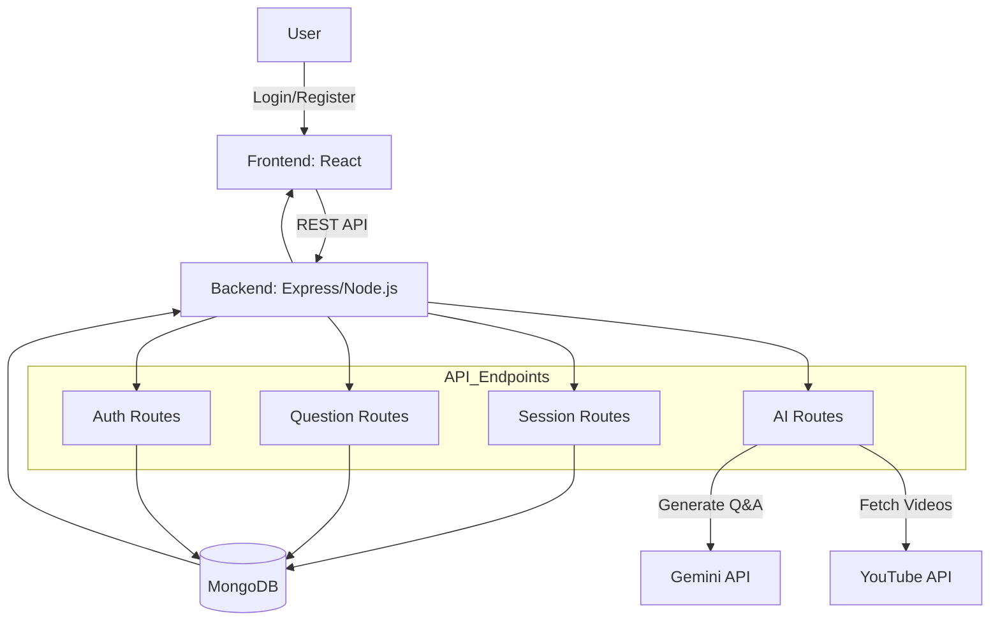
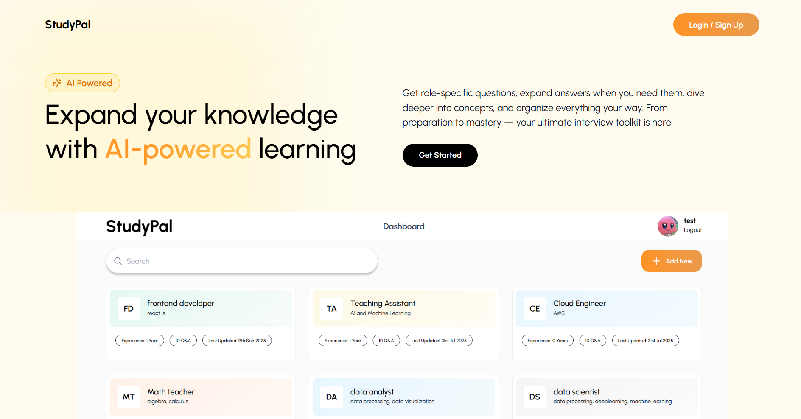
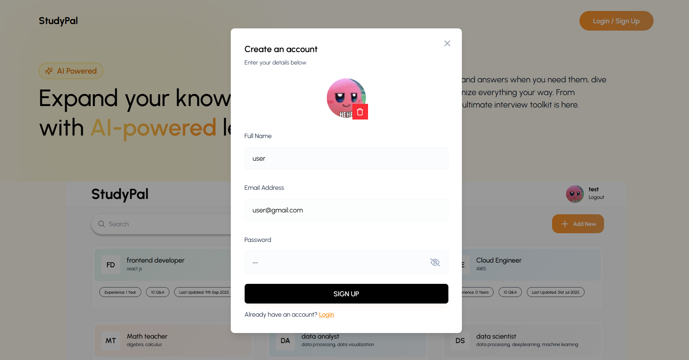
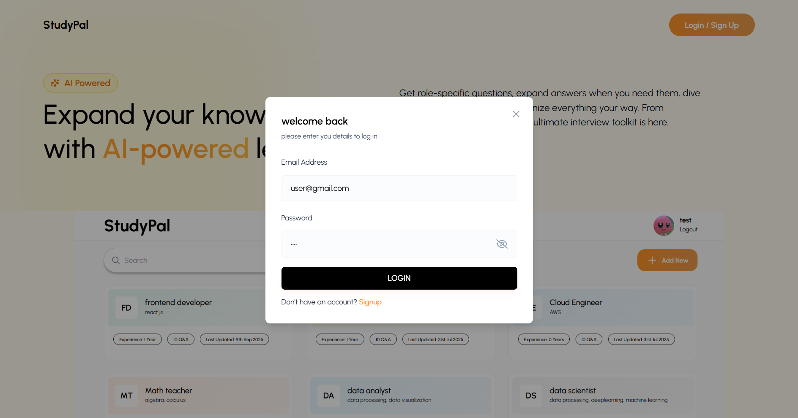
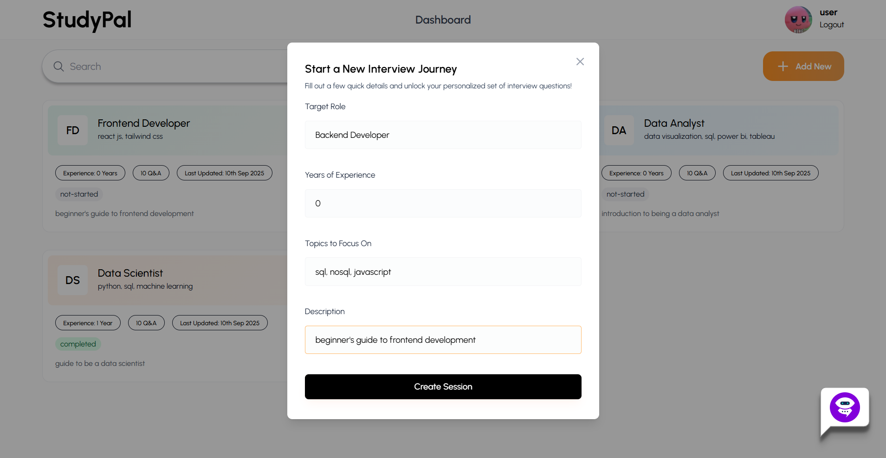
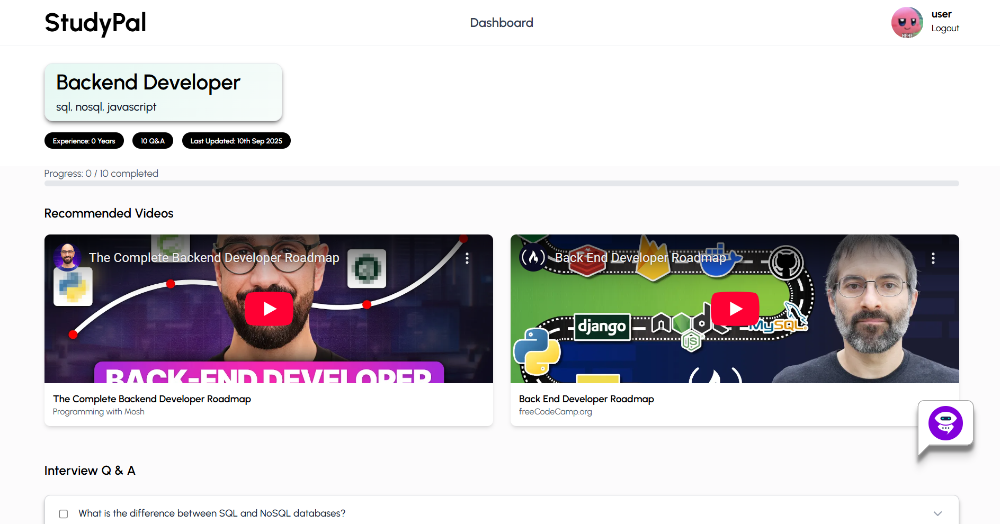
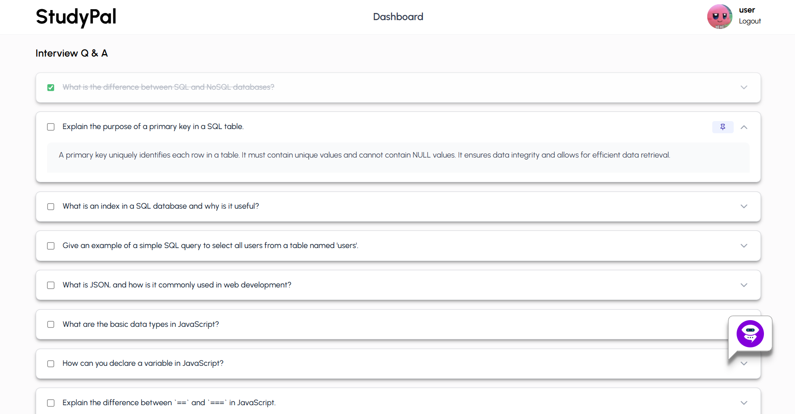
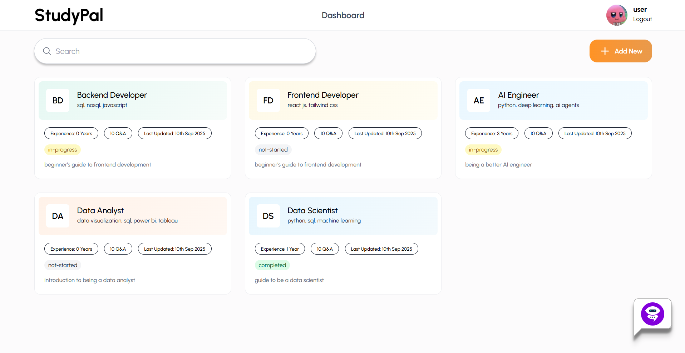
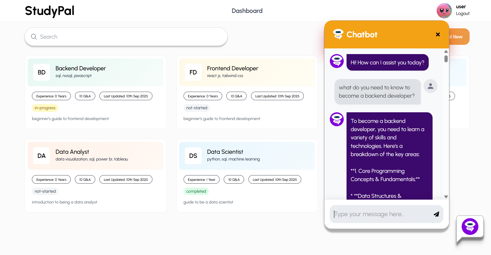
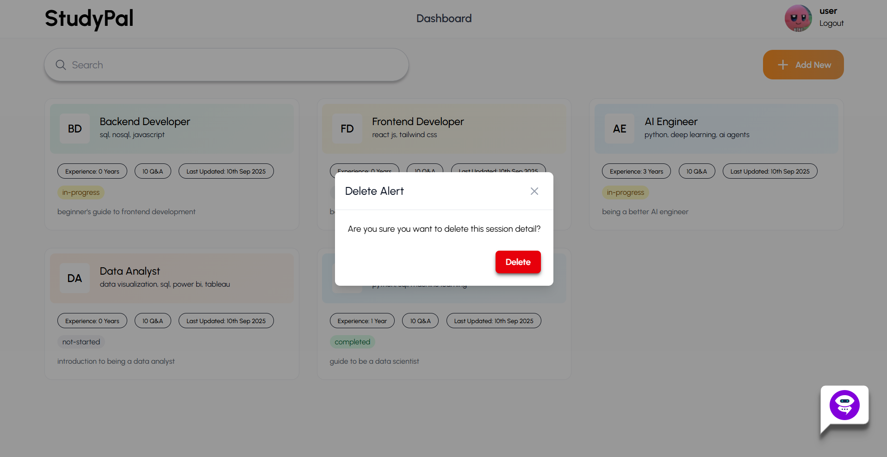

# StudyPal

An AI-powered web app where users can enter topics/roles, generate questions and answers on the chosen topics, mark progress, and explore recommended YouTube resources for deeper learning.

## Features

- **User Authentication**  
- **Session Management**  
  - Create sessions with role, experience, and focus topics  
  - AI-generated interview questions & answers
  - Progress tracking (completed, in-progress, not-started)  
- **Interactive Q&A**
  - Mark questions as completed
  - Pin important questions
  - Load more questions dynamically  
- **AI Chatbot (Gemini)** for additional learning  
- **YouTube Integration**  
  - Fetches relevant videos once per session
  - Videos are saved in session and displayed on interview prep page  
- **Dashboard Overview** with all sessions

## 🛠️ Tech Stack

**Frontend**
- React JS
- Vite
- Tailwind CSS
- Framer Motion (animations)
- Axios

**Backend**
- Node.js + Express
- MongoDB + Mongoose
- Passport (JWT)
- Gemini API (Google Generative AI)
- YouTube Data API v3

## Getting Started

### 1. Clone the repo
```bash
git clone https://github.com/L3tzG0/mernapp2.git
cd mernapp2
```

### 2. Setup Backend
```bash
cd backend
npm install
```

Create .env in backend/:

```env
PORT=8000
MONGO_URI=mongodb://127.0.0.1:27017/your-mongodb-uri
JWT_SECRET=your-jwt-secret
GEMINI_API_KEY=your-gemini-api-key
YOUTUBE_API_KEY=your-youtube-api-key
```

Run backend:

```bash
npm run dev
```

### 3. Setup Frontend
```bash
cd frontend
npm install
```

Run frontend:

```bash
npm run dev
```

Frontend runs at http://localhost:5173

Backend runs at http://localhost:8000

## Architecture Overview

**This application follows a client–server architecture with clear separation of concerns:**

- **Frontend (React + Vite + Tailwind CSS)**
    - Provides an interactive user interface for creating sessions, practicing Q&A, tracking progress, and discovering learning resources.
    - Communicates with backend via REST API calls (Axios).

- **Backend (Node.js + Express)**
    - Handles authentication, session and question management, and integrates external APIs.
    - Exposes RESTful endpoints under /api/... (e.g., /api/sessions, /api/questions, /api/ai)
    - Middleware enforces authentication (JWT-based).

- **Database (MongoDB with Mongoose)**
    - Stores user accounts, sessions, questions, and progress.
    - Schema-based design (Session ↔ Questions relationship).

- **External APIs**
    - Google Gemini API → Generates interview questions and explanations.
    - YouTube Data API → Fetches related learning resources for each session.

**High-Level Data Flow**
```css
[User Frontend] → [Axios API calls] → [Express Backend] → [MongoDB + External APIs]
                                    ↘ [Gemini / YouTube APIs]
```

## Technology Choices

- **Frontend: React (with Vite, Tailwind CSS)**
    - React provides component-based architecture, making UI modular and maintainable.
    - Vite offers faster development and build performance compared to CRA.
    - Tailwind CSS allows rapid UI design with utility classes.
    - 🔄 Alternative considered: Angular or Vue, but React was chosen for familiarity and ecosystem size.

- **Backend: Node.js + Express**
    - Express is lightweight, flexible, and widely used for REST APIs.
    - Middleware system makes it easy to handle authentication, logging, and validation.
    - 🔄 Alternative considered: Python (Django/Flask), but Node.js allows a single JavaScript stack (frontend + backend).

- **Database: MongoDB with Mongoose**
    - Flexible schema design fits Q&A sessions (nested questions, progress tracking).
    - Supports fast prototyping and scale-out with sharding/replication if needed.
    - 🔄 Alternative considered: PostgreSQL (relational), but MongoDB fits dynamic Q&A data better.

- **External APIs: Gemini + YouTube Data API**
    - Gemini: Generates tailored interview Q&A and explanations → directly supports learning objective.
    - YouTube: Provides curated video resources per session.
    - 🔄 Alternatives considered: OpenAI API, EdX/Coursera APIs, but Gemini + YouTube were chosen for cost, availability, and relevance.

## Critical Analysis

**What Works Well**

- End-to-end integration of AI (Gemini) and YouTube provides a rich learning experience.
- REST API design makes the system easy to extend (e.g., more integrations later).
- JWT-based authentication ensures secure user session handling.

**Current Limitations**
- API calls depend on third-party services (Gemini, YouTube) → possible failures if keys expire or rate limits are hit.
- No caching layer yet → repeated YouTube searches or AI calls may be slow or wasteful.
- Backend deployed locally only (if not deployed on cloud yet).

**Next Improvements**
- Implement API response caching (e.g., Redis) for repeated queries.
- Add API rate limiting (Express middleware) to protect backend from abuse.
- Enable cloud deployment (Render for backend, Vercel for frontend, MongoDB Atlas for DB).
- Introduce pagination and infinite scroll for questions and resources to improve scalability.
- Explore GraphQL layer for flexible client queries.

## API Endpoints Overview

The backend exposes RESTful endpoints grouped by feature:

**Authentication (/api/auth)**
- POST /api/auth/register → Register a new user
- POST /api/auth/login → Authenticate user & return JWT token
- GET /api/auth/profile → Get logged-in user details
- POST /api/auth/upload-image → Upload profile picture

**Sessions (/api/sessions)**
- POST /api/sessions/create → Create a new interview session with questions
- GET /api/sessions/my-sessions → Get all sessions for logged-in user
- GET /api/sessions/:id → Get details of a specific session (with questions)
- DELETE /api/sessions/:id → Delete a session

**Questions (/api/questions)**
- POST /api/questions/add → Add more questions to a session
- POST /api/questions/:id/pin → Pin or unpin a question
- PATCH /api/questions/:id/note → Update or add a note to a question
- PATCH /api/questions/:id/complete → Mark a question as completed/uncompleted

**AI (/api/ai)**
- POST /api/ai/generate-questions → Generate interview questions & answers (Gemini)
- POST /api/ai/generate-explanation → Generate a concept explanation (Gemini)

## Architecture Diagram



## Demo Walkthrough

Below are step-by-step screenshots of the application:


1. **Landing Page**  
  

2. **Register a new account**  
  

3. **Login with credentials**  
  

4. **Create a new session**  
  

5. **View session page: video, questions, and answers**
  
  

6. **Dashboard: view existing sessions**  
  

7. **Chatbot interface**  
  

8. **Delete session**  
  
  